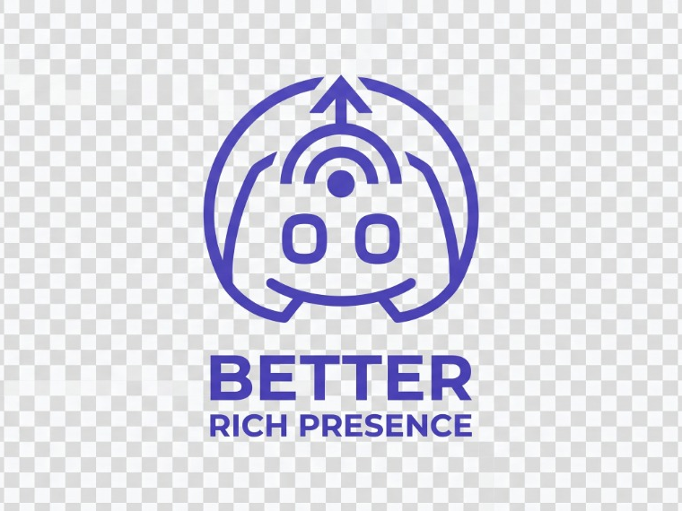
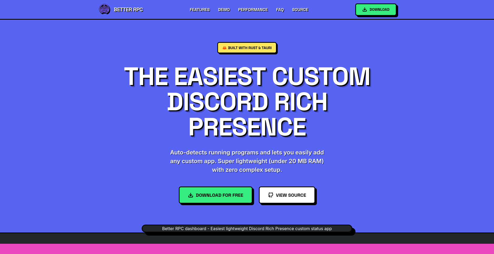

<div align="center">
  
  <br />
  
</div>

# Better Rich Presence For Discord

_[Leia isso em Português](README.pt.md)_

## What it Does

**Better Rich Presence** is an advanced, lightweight desktop application that automatically detects your current active window and updates your Discord Rich Presence accordingly. Whether you are coding in VSCode, designing in Figma, or browsing the web, Better RPC ensures your Discord status accurately reflects your activity in real-time, completely hands-free. 

## Advantages & Key Features

- **Zero Configuration:** Comes with over 20 pre-configured popular applications (VSCode, browsers, Adobe suite, etc.) ready to use out of the box.
- **Smart Priority Engine:** Prioritizes games and important applications over background tasks, ensuring your most relevant activity is what your friends see.
- **Anti-Flicker Logic:** Smooth transitions between apps, preventing status flickering when quickly tabbing between windows.
- **Idle Detection:** Automatically changes your status to "Idle" when you step away from your keyboard for a period of time.
- **Native Performance:** Built with Rust and Tauri using native Windows Win32 APIs, ensuring minimal CPU usage and a tiny memory footprint.
- **Modern UI:** Features a beautiful, retro-arcade Neo-Brutalist design interface built with React and TailwindCSS.

## How to Compile and Run

### Prerequisites

To run or build this project locally, you will need the following dependencies installed on your machine:

- [Node.js](https://nodejs.org/) (v18 or higher)
- [Rust](https://www.rust-lang.org/tools/install)
- [Visual Studio Build Tools](https://visualstudio.microsoft.com/visual-cpp-build-tools/) (Required for compiling Rust on Windows, make sure to select "Desktop development with C++")

### Running in Development Mode

1. Clone the repository and navigate to the project directory:
   ```bash
   git clone https://github.com/Joao-Camilo-Mallmann/Better-Rich-Presence-For-Discord.git
   cd Better-Rich-Presence-For-Discord
   ```

2. Install the JavaScript dependencies:
   ```bash
   npm install
   ```

3. Run the application (this compiles the Rust backend and starts the React frontend):
   ```bash
   npm run tauri dev
   ```

### Building for Production

To create a standalone `.exe` installer for Windows:

```bash
npm run tauri build
```

The compiled installer will be outputted to the `src-tauri/target/release/bundle/nsis/` directory.
