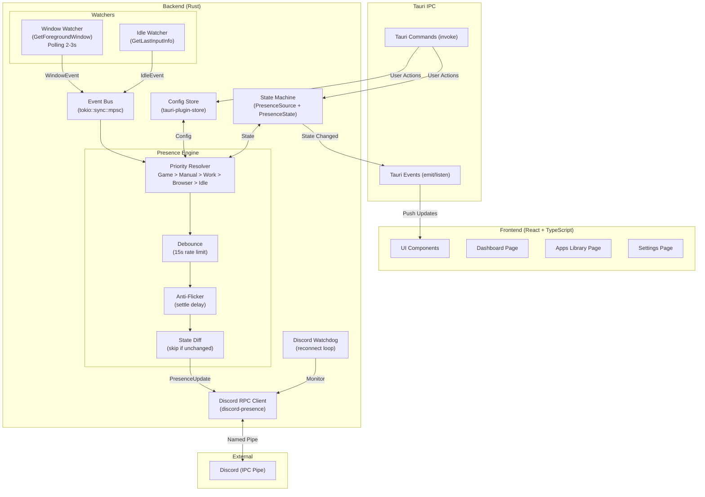

# Better Rich Presence For Discord — v1 Implementation Plan

Aplicação desktop nativa (Tauri v2 + Rust + React) que gerencia Discord Rich Presence de forma inteligente, detectando automaticamente o app ativo e exibindo presença customizável no Discord.

---

## User Review Required

> [!IMPORTANT]
> **Discord Application ID**: Você precisa criar uma Application no [Discord Developer Portal](https://discord.com/developers/applications) e fornecer o Client ID antes do desenvolvimento começar. Os assets de ícones (VSCode, Chrome, etc.) também serão hospedados lá.

> [!WARNING]
> **Code Signing**: Para o `tauri-plugin-updater` funcionar no Windows com NSIS, é necessário assinar o executável. Para a v1 isso pode ser adiado, mas considere obter um certificado de code signing antes da distribuição pública.

---

## Decisões Consolidadas (Grill-Me)

| Decisão | Escolha |
|---|---|
| Frontend | React + TypeScript (Vite) |
| Framework | Tauri v2 (2.11.x) |
| Discord RPC | `discord-presence` v3.2 (Rust puro, IPC/pipes) |
| Win32 API | `windows` v0.59 (microsoft/windows-rs) |
| Plataforma | Windows only (v1) |
| Prioridade | Fixa: Game > Manual > Work > Browser > Idle |
| Detecção de Jogos | Delegar ao Discord |
| Storage | `tauri-plugin-store` v2.4.x |
| Tema | Dark Discord-like (#2B2D31 bg, #5865F2 accent) |
| Layout | Sidebar com seções (Dashboard, Apps, Configurações) |
| Watcher | Polling 2-3s (`GetForegroundWindow`) |
| Idle | `GetLastInputInfo` |
| Tray | X fecha para tray, menu de contexto |
| Autostart | Ativado por padrão (`tauri-plugin-autostart`) |
| Assets | Discord Developer Portal |
| App ID | Fixo embutido no código |
| Distribuição | NSIS + GitHub Releases |
| Event Bus | `tokio::sync::mpsc` (Rust) + Tauri Events (→ Frontend) |
| CSS | CSS Modules |
| IPC Frontend↔Backend | Tauri Commands + Events |

---

## Escopo v1

- ✅ Presence Engine (event bus, debounce 15s, rate limit, anti-flicker)
- ✅ Window Watcher (detectar app ativo via Win32, polling 2-3s)
- ✅ Discord RPC (conectar, set_activity, clear_activity, watchdog/reconexão)
- ✅ State Machine (PresenceSource, PresenceState)
- ✅ Idle Detection (GetLastInputInfo, thresholds configuráveis)
- ✅ Biblioteca de Apps (AppRules editáveis com ~20 presets)
- ✅ System Tray + Autostart
- ✅ Dashboard UI (fonte atual, estado, preview)
- ✅ Desconexão segura (clear on exit/crash)

**Fora do escopo v1** (v1.1+): Export/Import, Backup automático, Modo Privacidade, Logs avançados, Auto-update, Perfis Manuais customizáveis.

---

## Arquitetura



---

## Proposed Changes

### Component 1: Project Scaffolding

Inicializar o projeto Tauri v2 com React + TypeScript.

#### [NEW] Projeto Tauri v2

Inicializar via `npm create tauri-app@latest` com:
- Frontend: React + TypeScript
- Package manager: npm

#### [NEW] [Cargo.toml](file:///home/joao/projects/Better-Rich-Presence-For-Discord/src-tauri/Cargo.toml)

```toml
[dependencies]
tauri = { version = "2", features = ["tray-icon"] }
tauri-plugin-store = "2"
tauri-plugin-autostart = "2"
serde = { version = "1", features = ["derive"] }
serde_json = "1"
log = "0.4"
tokio = { version = "1", features = ["sync", "time", "macros"] }
discord-presence = "3.2"
sysinfo = "0.33"

[target.'cfg(windows)'.dependencies.windows]
version = "0.59"
features = [
    "Win32_Foundation",
    "Win32_UI_WindowsAndMessaging",
    "Win32_UI_Input_KeyboardAndMouse",
]
```

#### [NEW] NPM dependencies

```bash
npm install @tauri-apps/plugin-store @tauri-apps/plugin-autostart
```

---

### Component 2: Rust Types & State Machine

Definir os tipos core que toda a aplicação consome.

#### [NEW] [types.rs](file:///home/joao/projects/Better-Rich-Presence-For-Discord/src-tauri/src/types.rs)

```rust
#[derive(Debug, Clone, PartialEq, Eq, Hash, Serialize, Deserialize)]
pub enum PresenceSource {
    Game,    // Prioridade 0 (máxima)
    Manual,  // Prioridade 1
    Work,    // Prioridade 2
    Browser, // Prioridade 3
    Idle,    // Prioridade 4 (mínima)
}

#[derive(Debug, Clone, PartialEq, Eq, Serialize, Deserialize)]
pub enum PresenceState {
    Disconnected,
    WaitingDiscord,
    Connected,
    PausedByGame,
    Updating,
}

#[derive(Debug, Clone, Serialize, Deserialize)]
pub struct AppRule {
    pub process_name: String,
    pub display_name: String,
    pub details: String,
    pub state: String,
    pub large_image: String,
    pub source: PresenceSource,
    pub priority: u32,
    pub enabled: bool,
}

#[derive(Debug, Clone, Serialize, Deserialize)]
pub struct PresenceData {
    pub details: String,
    pub state: String,
    pub large_image: String,
    pub large_text: String,
    pub source: PresenceSource,
    pub timestamp: Option<i64>,
}

#[derive(Debug, Clone)]
pub enum EngineEvent {
    WindowChanged { process_name: String, window_title: String },
    IdleChanged { idle: bool, idle_minutes: u32 },
    ManualProfile(PresenceData),
    Shutdown,
}
```

---

### Component 3: Window Watcher (Win32)

Polling da janela ativa + detecção de idle.

#### [NEW] [watcher.rs](file:///home/joao/projects/Better-Rich-Presence-For-Discord/src-tauri/src/watcher.rs)

- Spawn uma `tokio::task` que faz polling a cada 2 segundos
- Usa `GetForegroundWindow` → `GetWindowThreadProcessId` → `sysinfo` para pegar o nome do processo
- Usa `GetWindowTextW` para pegar o título da janela
- Usa `GetLastInputInfo` para detectar idle
- Envia `EngineEvent::WindowChanged` e `EngineEvent::IdleChanged` via `mpsc::Sender`
- Só envia evento se o processo/janela mudou desde o último poll (evita spam)

---

### Component 4: Presence Engine

O núcleo do app. Recebe eventos, resolve prioridades, aplica debounce, e envia para o Discord.

#### [NEW] [engine.rs](file:///home/joao/projects/Better-Rich-Presence-For-Discord/src-tauri/src/engine.rs)

- Consome eventos do `mpsc::Receiver`
- **Priority Resolver**: Recebe `WindowChanged`, faz match contra `AppRules` do store. Determina `PresenceSource` e prioridade. Se fonte atual tem prioridade maior, ignora.
- **State Diff**: Compara `PresenceData` novo com o atual. Se idêntico, skip.
- **Debounce/Anti-Flicker**: Após receber um evento de troca, aguarda 3 segundos (settle delay). Se outro evento chega nesse período, reseta o timer. Rate limit de 15 segundos entre updates reais.
- **Discord RPC**: Chama `set_activity()` via `spawn_blocking` (pois `discord-presence` é síncrono)
- **State Machine**: Atualiza `PresenceState` e emite Tauri Event para o frontend

Fluxo:
```
WindowChanged → match AppRules → resolve priority → settle delay (3s) → diff check → rate limit (15s) → set_activity()
```

---

### Component 5: Discord RPC Manager

Gerencia a conexão com o Discord e implementa o watchdog.

#### [NEW] [discord.rs](file:///home/joao/projects/Better-Rich-Presence-For-Discord/src-tauri/src/discord.rs)

- Inicializa `discord_presence::Client` com o Application ID fixo
- Thread dedicada (via `std::thread::spawn`) que:
  - Mantém a conexão RPC
  - Expõe interface via `mpsc` channel para receber comandos (`SetActivity`, `ClearActivity`, `Disconnect`)
  - Detecta pipe quebrado e tenta reconectar automaticamente (backoff: 3s, 5s, 10s, 30s)
- Wrap síncrono: `DiscordHandle` com métodos `set_activity()`, `clear_activity()`, `is_connected()`
- `clear_activity()` + `disconnect()` no `Drop` (desconexão segura)

---

### Component 6: App Library (Presets)

~20 presets de aplicativos pré-configurados.

#### [NEW] [presets.rs](file:///home/joao/projects/Better-Rich-Presence-For-Discord/src-tauri/src/presets.rs)

Presets padrão carregados na primeira execução e salvos no `tauri-plugin-store`:

| App | process_name | Source |
|---|---|---|
| VSCode | `code.exe` | Work |
| Cursor | `cursor.exe` | Work |
| IntelliJ IDEA | `idea64.exe` | Work |
| Android Studio | `studio64.exe` | Work |
| Visual Studio | `devenv.exe` | Work |
| Figma | `figma.exe` | Work |
| Photoshop | `photoshop.exe` | Work |
| Premiere Pro | `adobe premiere pro.exe` | Work |
| After Effects | `afterfx.exe` | Work |
| Blender | `blender.exe` | Work |
| Excel | `excel.exe` | Work |
| Word | `winword.exe` | Work |
| PowerPoint | `powerpnt.exe` | Work |
| Notion | `notion.exe` | Work |
| Obsidian | `obsidian.exe` | Work |
| Slack | `slack.exe` | Work |
| Terminal | `windowsterminal.exe` | Work |
| Docker Desktop | `docker desktop.exe` | Work |
| GitHub Desktop | `githubdesktop.exe` | Work |
| Spotify | `spotify.exe` | Browser |
| Chrome | `chrome.exe` | Browser |
| Firefox | `firefox.exe` | Browser |
| Edge | `msedge.exe` | Browser |

Cada preset tem `details`, `state`, `large_image` (asset key no Discord) pré-preenchidos. Usuário pode editar tudo.

---

### Component 7: Tauri Commands (IPC)

Comandos expostos ao frontend.

#### [NEW] [commands.rs](file:///home/joao/projects/Better-Rich-Presence-For-Discord/src-tauri/src/commands.rs)

```rust
// State queries
#[tauri::command] fn get_current_presence() -> PresenceData
#[tauri::command] fn get_presence_state() -> PresenceState
#[tauri::command] fn get_current_source() -> PresenceSource

// App library
#[tauri::command] fn get_app_rules() -> Vec<AppRule>
#[tauri::command] fn update_app_rule(rule: AppRule)
#[tauri::command] fn add_app_rule(rule: AppRule)
#[tauri::command] fn delete_app_rule(process_name: String)
#[tauri::command] fn reset_app_rules_to_defaults()

// Settings
#[tauri::command] fn get_settings() -> Settings
#[tauri::command] fn update_settings(settings: Settings)

// Connection
#[tauri::command] fn get_connection_status() -> ConnectionInfo
```

#### Tauri Events (Backend → Frontend)

```rust
app.emit("presence-updated", &presence_data)?;
app.emit("state-changed", &presence_state)?;
app.emit("connection-changed", &connection_info)?;
```

---

### Component 8: Main Setup

#### [NEW] [lib.rs](file:///home/joao/projects/Better-Rich-Presence-For-Discord/src-tauri/src/lib.rs)

```rust
pub fn run() {
    tauri::Builder::default()
        .plugin(tauri_plugin_store::Builder::new().build())
        .plugin(tauri_plugin_autostart::Builder::new().build())
        .setup(|app| {
            // 1. Load/init config from store
            // 2. Init app presets if first run
            // 3. Create system tray (Abrir, Pausar, Sair)
            // 4. Create mpsc channel
            // 5. Spawn Discord RPC manager thread
            // 6. Spawn Window Watcher task
            // 7. Spawn Presence Engine task
            // 8. Handle close-to-tray (prevent_close)
            Ok(())
        })
        .invoke_handler(tauri::generate_handler![...])
        .on_window_event(|window, event| {
            // Intercept close → hide to tray
        })
        .run(tauri::generate_context!())
        .expect("error while running application");
}
```

---

### Component 9: Frontend — Design System

#### [NEW] [globals.css](file:///home/joao/projects/Better-Rich-Presence-For-Discord/src/globals.css)

Design tokens Discord-like:

```css
:root {
  /* Background */
  --bg-primary: #1E1F22;
  --bg-secondary: #2B2D31;
  --bg-tertiary: #313338;
  --bg-modifier-hover: rgba(79, 84, 92, 0.16);

  /* Text */
  --text-primary: #F2F3F5;
  --text-secondary: #B5BAC1;
  --text-muted: #949BA4;

  /* Brand */
  --brand-primary: #5865F2;
  --brand-hover: #4752C4;

  /* Status */
  --status-online: #23A559;
  --status-idle: #F0B232;
  --status-dnd: #F23F43;
  --status-offline: #80848E;

  /* Layout */
  --sidebar-width: 220px;
  --border-radius: 8px;
  --transition: 150ms ease;
}
```

Font: Inter (Google Fonts).

---

### Component 10: Frontend — Layout & Pages

#### [NEW] [App.tsx](file:///home/joao/projects/Better-Rich-Presence-For-Discord/src/App.tsx)

Layout principal: Sidebar fixa à esquerda + content area à direita.

#### [NEW] [components/Sidebar.tsx](file:///home/joao/projects/Better-Rich-Presence-For-Discord/src/components/Sidebar.tsx)

Itens de navegação:
- 🏠 Dashboard
- 📱 Aplicativos
- ⚙️ Configurações

Indicador de status da conexão Discord no rodapé.

#### [NEW] [pages/Dashboard.tsx](file:///home/joao/projects/Better-Rich-Presence-For-Discord/src/pages/Dashboard.tsx)

- Card "Presença Atual" (preview do que aparece no Discord)
- Indicador de fonte atual (🎮 Game, 💼 Work, 🌐 Browser, 💤 Idle)
- Estado da conexão (Connected, Disconnected, etc.)
- Tempo ativo (elapsed since)
- Botão toggle Pausar/Resumir

#### [NEW] [pages/Apps.tsx](file:///home/joao/projects/Better-Rich-Presence-For-Discord/src/pages/Apps.tsx)

- Lista de AppRules em cards
- Toggle enabled/disabled por app
- Editar details, state, imagem ao clicar
- Botão "Adicionar App Custom"
- Botão "Resetar para Padrão"
- Search/filter

#### [NEW] [pages/Settings.tsx](file:///home/joao/projects/Better-Rich-Presence-For-Discord/src/pages/Settings.tsx)

- **Geral**: Iniciar com Windows (toggle), Minimizar para tray (toggle)
- **Idle**: Ativado/Desativado, Threshold (5/10/30 min), Mensagem idle
- **Avançado**: Intervalo de debounce, Settle delay anti-flicker

---

### Component 11: Frontend — State Management

#### [NEW] [hooks/usePresence.ts](file:///home/joao/projects/Better-Rich-Presence-For-Discord/src/hooks/usePresence.ts)

Custom hook que:
- Escuta Tauri Events (`presence-updated`, `state-changed`, `connection-changed`)
- Mantém estado local via `useState`
- Expõe dados reativos para os componentes

#### [NEW] [hooks/useAppRules.ts](file:///home/joao/projects/Better-Rich-Presence-For-Discord/src/hooks/useAppRules.ts)

Custom hook para CRUD de AppRules via Tauri Commands.

#### [NEW] [hooks/useSettings.ts](file:///home/joao/projects/Better-Rich-Presence-For-Discord/src/hooks/useSettings.ts)

Custom hook para ler/salvar configurações.

---

## Estrutura de Arquivos Final

```
Better-Rich-Presence-For-Discord/
├── src/                          # Frontend React
│   ├── App.tsx
│   ├── globals.css
│   ├── main.tsx
│   ├── components/
│   │   ├── Sidebar/
│   │   │   ├── Sidebar.tsx
│   │   │   └── Sidebar.module.css
│   │   ├── PresenceCard/
│   │   │   ├── PresenceCard.tsx
│   │   │   └── PresenceCard.module.css
│   │   └── AppRuleCard/
│   │       ├── AppRuleCard.tsx
│   │       └── AppRuleCard.module.css
│   ├── pages/
│   │   ├── Dashboard/
│   │   │   ├── Dashboard.tsx
│   │   │   └── Dashboard.module.css
│   │   ├── Apps/
│   │   │   ├── Apps.tsx
│   │   │   └── Apps.module.css
│   │   └── Settings/
│   │       ├── Settings.tsx
│   │       └── Settings.module.css
│   └── hooks/
│       ├── usePresence.ts
│       ├── useAppRules.ts
│       └── useSettings.ts
├── src-tauri/                    # Backend Rust
│   ├── Cargo.toml
│   ├── tauri.conf.json
│   ├── capabilities/
│   │   └── default.json
│   ├── icons/
│   └── src/
│       ├── lib.rs                # Entry point + Tauri setup
│       ├── types.rs              # PresenceSource, PresenceState, AppRule, etc.
│       ├── engine.rs             # Presence Engine (priority, debounce, anti-flicker)
│       ├── watcher.rs            # Window Watcher + Idle Detection
│       ├── discord.rs            # Discord RPC client + Watchdog
│       ├── presets.rs            # Default AppRule presets
│       └── commands.rs           # Tauri IPC commands
├── package.json
├── tsconfig.json
├── vite.config.ts
└── index.html
```

---

## Verification Plan

### Automated Tests

```bash
# Build check (compilação sem erros)
cd src-tauri && cargo check

# Rust unit tests (types, priority resolver, state machine)
cd src-tauri && cargo test

# Frontend build check
npm run build

# Full Tauri build (NSIS installer)
npm run tauri build
```

### Manual Verification

1. **System Tray**: Verificar que o app aparece no tray, menu funciona, X fecha para tray
2. **Autostart**: Reiniciar Windows e verificar que o app inicia automaticamente
3. **Window Detection**: Alternar entre VSCode, Chrome, Terminal e verificar que o Dashboard mostra o app correto
4. **Discord Presence**: Verificar no Discord (outro usuário ou conta alt) que a presença muda corretamente
5. **Debounce/Anti-Flicker**: Trocar rapidamente entre apps e verificar que não há spam de updates
6. **Idle**: Deixar o PC sem input por 5min e verificar transição para Idle
7. **Watchdog**: Fechar e reabrir o Discord, verificar reconexão automática
8. **App Library**: Editar um AppRule, desabilitar outro, adicionar custom — verificar persistência após restart
9. **Desconexão segura**: Fechar o app e verificar que presença some do Discord
