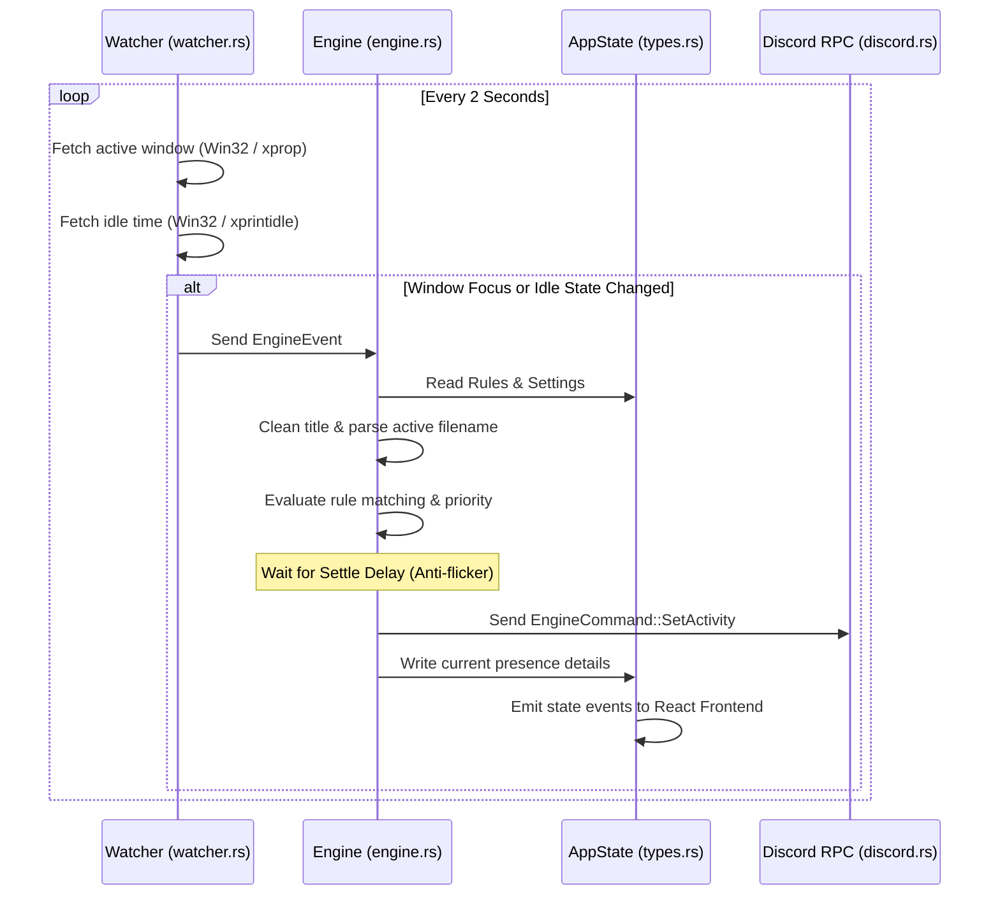
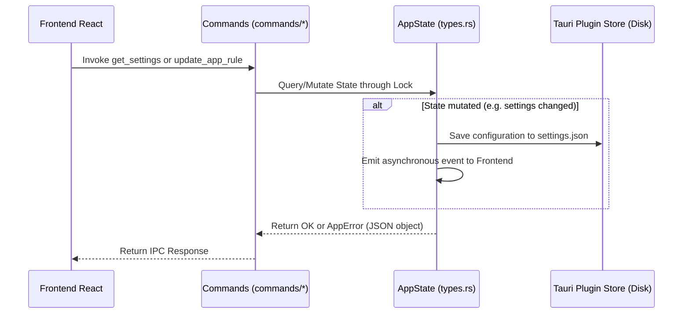

# Rust Backend Folder Structure & Architecture

This document describes the directory organization of the Rust backend (`src-tauri/src`) for the **Better Rich Presence for Discord** project, detailing the responsibilities of each file and the flow of data between components.

---

## 1. Directory Map

The modular backend structure is split into three main layers under the `src/` root:

```text
src-tauri/src/
├── main.rs
├── lib.rs
├── models/
│   ├── mod.rs
│   ├── types.rs
│   └── presets.rs
├── services/
│   ├── mod.rs
│   ├── discord.rs
│   ├── engine.rs
│   ├── watcher.rs
│   └── parser.rs
└── commands/
    ├── mod.rs
    ├── presence.rs
    ├── rules.rs
    ├── settings.rs
    └── system.rs
```

---

## 2. Layers & Component Responsibilities

### 2.1. Startup & Entrypoint (Root)
- **[main.rs](file:///home/joao/projects/Better-Rich-Presence-For-Discord/src-tauri/src/main.rs):** Standard entrypoint. Disables the command console window on Windows in release builds and starts the library execution loop.
- **[lib.rs](file:///home/joao/projects/Better-Rich-Presence-For-Discord/src-tauri/src/lib.rs):** Orchestrates the startup setup loop, loads initial settings and rules from JSON stores, instantiates event channels, spawns background services, and registers the Tauri IPC commands handler. It also handles intercepting the application exit event to clean up Discord presence.

### 2.2. Models Layer (`models/`)
Defines the core data structures, enums, and initial static presets:
- **[types.rs](file:///home/joao/projects/Better-Rich-Presence-For-Discord/src-tauri/src/models/types.rs):** Defines the unified `AppState` manager (protected by a single asynchronous `RwLock`), the structured JSON error type `AppError`, and data structures (`Settings`, `AppRule`, `PresenceData`).
- **[presets.rs](file:///home/joao/projects/Better-Rich-Presence-For-Discord/src-tauri/src/models/presets.rs):** Holds static definitions of default window-matching rules for over 20 popular applications (editors, browsers, and design suites).

### 2.3. Services Layer (`services/`)
Houses asynchronous background workers and integrations:
- **[watcher.rs](file:///home/joao/projects/Better-Rich-Presence-For-Discord/src-tauri/src/services/watcher.rs):** Actively monitors active window changes and keyboard/mouse ociosity (via Win32 on Windows, and `xprop` and `xprintidle` commands on Linux).
- **[engine.rs](file:///home/joao/projects/Better-Rich-Presence-For-Discord/src-tauri/src/services/engine.rs):** The central engine that receives window events, applies priority rules, processes the active file/application title, handles rate limits/debounces, and pushes updates to the Discord RPC thread.
- **[discord.rs](file:///home/joao/projects/Better-Rich-Presence-For-Discord/src-tauri/src/services/discord.rs):** Runs the synchronous `discord-presence` client on a dedicated OS thread to prevent blocking the async Tokio runtime. Communicates with the engine via an `mpsc` channel.
- **[parser.rs](file:///home/joao/projects/Better-Rich-Presence-For-Discord/src-tauri/src/services/parser.rs):** Pure utility functions for cleaning window titles (extracting filenames) and resolving favicon URLs for auto-generated presence images.

### 2.4. Commands Layer (`commands/`)
Exposes public Tauri commands invoked by the React frontend:
- **[presence.rs](file:///home/joao/projects/Better-Rich-Presence-For-Discord/src-tauri/src/commands/presence.rs):** Queries connection info and current presence payload.
- **[rules.rs](file:///home/joao/projects/Better-Rich-Presence-For-Discord/src-tauri/src/commands/rules.rs):** Adds, deletes, modifies, or resets executable matching rules.
- **[settings.rs](file:///home/joao/projects/Better-Rich-Presence-For-Discord/src-tauri/src/commands/settings.rs):** Reads and updates configuration settings.
- **[system.rs](file:///home/joao/projects/Better-Rich-Presence-For-Discord/src-tauri/src/commands/system.rs):** Lists active processes running in the operating system.

---

## 3. Data & Communication Flows

### 3.1. Background Tracking Flow


### 3.2. Frontend Command Invocation Flow

